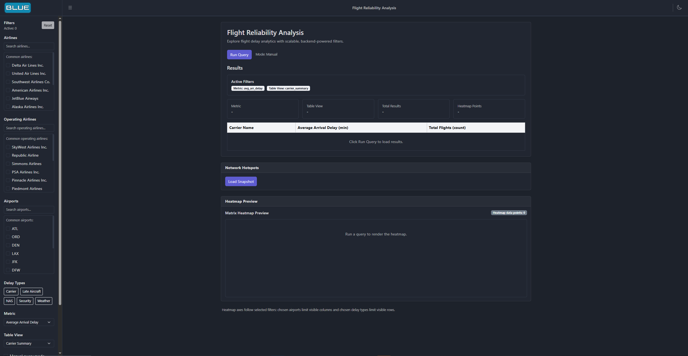
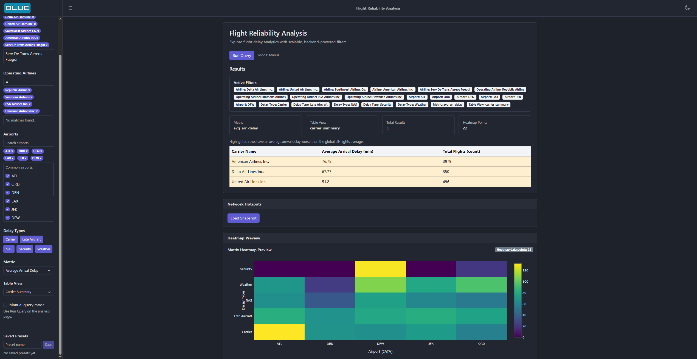

# Flight Reliability Analysis Platform

A full-stack data analytics platform for exploring U.S. flight delay patterns. The application provides interactive filtering, aggregation, and visualization of flight performance using a scalable backend and a modern React-based frontend. This application aims to solve the problem of having limited tools for efficiently analyzing and comparing aviation data across airlines, airports, and time periods.

---

## Live Demo

Current: http://35.224.149.142/#/heatmap (deploy/gcp-mysql-v2 branch)

Legacy Version: http://35.238.105.121:3000/#/heatmap (deploy/gcp-mysql branch)

---

## Filtering Visualization Example

This demonstrates how the application dynamically filters and updates flight data based on user input.

| Before Filter | After Filter |
|--------------|-------------|
|  |  |

---

## Video Link

https://drive.google.com/file/d/1EhQSBxosYcxledw47ajsMI7JrOGTz9b3/view 

---

## Overview

This project enables users to:

- Filter flights by airline, airport, and delay type  
- Execute dynamic analytical queries  
- View aggregated metrics such as average arrival delay and total flights  
- Explore results through tabular views and heatmap visualizations  

The system supports both local development and cloud deployment.

---

## Architecture

- **Frontend**: React (CoreUI Admin Template, Vite)  
- **Backend**: FastAPI with SQLAlchemy  
- **Database**: MySQL (Cloud SQL or Dockerized locally)  

```
Frontend (React + CoreUI)
↓ HTTP (REST API)
Backend (FastAPI + SQLAlchemy)
↓ SQL
Database (MySQL)
```

---

## Tech Stack

### Frontend

- React (Vite)  
- CoreUI React Admin Template  
  https://github.com/coreui/coreui-free-react-admin-template  
- Plotly (heatmap visualization)  
  https://plotly.com/python/heatmaps/  

### Backend

- FastAPI  
- SQLAlchemy  
- PyMySQL  

### Infrastructure

- Google Cloud Compute Engine  
- Google Cloud SQL (MySQL)  
- Cloud SQL Proxy  
- Docker (local development)  

---

## Cloud Deployment (GCP - MySQL)

The live system is deployed using:

- Compute Engine VM  
- Cloud SQL (MySQL)  
- Cloud SQL Proxy  

### Running Services

| Service           | Port |
|------------------|------|
| Frontend         | 3000 |
| Backend API      | 8080 |
| Cloud SQL Proxy  | 3307 |

The application is accessible via the VM external IP.

---

## Project Structure

```
sp26-cs411-team028-blue
├── backend/          # FastAPI application
├── frontend/         # React + CoreUI frontend
├── db/               # schema and data loaders
├── docker-compose.yml
└── README.md
```

---

## Local Setup Guide

These instructions are for running the local Dockerized development version after cloning or unzipping the project.

### Prerequisites

Install the following before running the project:

- Docker Desktop  
- Python 3.10+  
- Node.js 22+  
- npm (included with Node.js)  
- Git  

---

### 1. Clone or Unzip the Project

If cloning from GitHub:

```bash
git clone https://github.com/cs411-alawini/sp26-cs411-team028-blue.git
cd sp26-cs411-team028-blue
```

If using a ZIP file, unzip it and navigate into the folder:

```bash
cd sp26-cs411-team028-blue
```

---

### 2. Start the Local Database

Make sure Docker Desktop is running:

```bash
docker compose up -d
```

---

### 3. Install Backend Dependencies

```bash
cd backend
python -m pip install -r requirements.txt
cd ..
```

---

### 4. Load the Database

Load dimension tables before fact tables:

```bash
python db/loaders/load_dimensions.py
python db/loaders/load_facts.py
```

Dimension tables must be loaded first because fact tables depend on them through foreign keys.

---

### 5. Start the Backend

```bash
cd backend
python -m uvicorn app.main:app --reload --port 8011
```

---

### 6. Start the Frontend

Open a new terminal:

```bash
cd frontend
npm install
npm start
```

---

### 7. Open the Application

http://localhost:3000

---

## Dependency Requirements

### Backend

Dependencies are listed in:

```
backend/requirements.txt
```

Install with:

```bash
pip install -r backend/requirements.txt
```

---

### Frontend

Dependencies are listed in:

```
frontend/package.json
```

Install with:

```bash
cd frontend
npm install
```

---

### Database

The local PostgreSQL database is managed via Docker:

```
docker-compose.yml
```

---

## Development Notes

- The project was originally built using PostgreSQL for local development  
- The deployed system was adapted to MySQL for Cloud SQL compatibility  
- Some SQL queries differ between PostgreSQL and MySQL implementations  
- CORS is configured for cross-origin communication between frontend and backend  
- Cloud deployment uses persistent processes managed via `screen`  

---

## Release and Submission

- Each stage submission is tagged as `stage.x`  
- Submissions are tied to specific commit hashes  
- Releases represent frozen versions of the project for evaluation  

---

## References

- CoreUI React Admin Template ([GitHub](https://github.com/coreui/coreui-free-react-admin-template))  
- Plotly Heatmaps ([Docs](https://plotly.com/python/heatmaps/))  

---

## License

This project is released under the MIT License.  
CoreUI template is also licensed under MIT.
